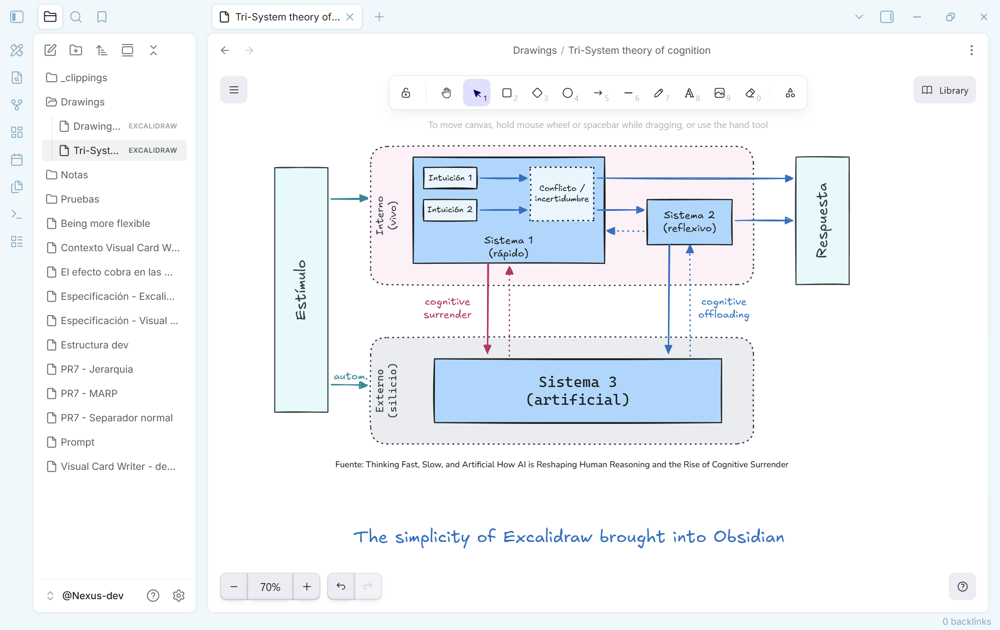

# Just Simple Excalidraw

An intentionally small, local-first [Excalidraw](https://excalidraw.com/) editor
for Obsidian that preserves the original's brilliant simplicity. It edits
portable `.excalidraw` JSON files directly in the vault.



## Why this plugin exists

Excalidraw is brilliant because it makes drawing feel immediate. Open a canvas,
think with your hands, and get out of the way. Just Simple Excalidraw brings
that essential experience to an offline Obsidian vault without turning it into
another complex workspace.

The excellent [Obsidian Excalidraw plugin by zsviczian](https://github.com/zsviczian/obsidian-excalidraw-plugin)
offers extensive integrations and a large feature set for people who need them.
This plugin has a deliberately different goal: no feature race, no extra
workflow layer, and no attempt to reproduce hundreds of options. It is for
people who want the original, focused Excalidraw canvas inside Obsidian.

If Excalidraw is an important part of your work, please consider supporting the
upstream team with [Excalidraw+](https://plus.excalidraw.com/). This plugin uses
the open-source editor locally; Excalidraw+ helps sustain the product and adds
online services for users who need them. If you need the advanced features this
plugin intentionally leaves out, Excalidraw+ is the better fit—and directly
supports the people building Excalidraw.

## What it does

- Creates and opens native `.excalidraw` drawings from the command palette or
  the ribbon.
- Uses the official Excalidraw editor with its standard drawing tools.
- Saves automatically after a short pause and writes images into the drawing as
  embedded data, so a drawing stays self-contained.
- Stops autosave if its file changes outside the open editor, avoiding silent
  overwrites.
- Reports malformed drawings without changing the original file.
- Follows Obsidian's light and dark theme.

It deliberately does **not** add Markdown embedding, OCR, AI, collaboration,
cloud sync, a drawing library, an account, or an export workflow. Those are
valuable features in other tools; they are outside this plugin's purpose. The
lean build also excludes Mermaid-to-Excalidraw conversion, web embeds, and the
related heavy dependency tree.

## Lean build and Obsidian Sync

Community Plugins installs `main.js`, `manifest.json`, and `styles.css` from a
GitHub release. Since Obsidian Sync Standard cannot sync a plugin file larger
than 5 MB, this plugin keeps its release `main.js` below that limit.

That constraint is intentional: Just Simple Excalidraw ships a focused editor,
not every optional Excalidraw subsystem. It includes one embedded Excalifont
subset covering Latin characters, including Spanish accents. Other scripts and
the optional Excalidraw font variants fall back to fonts available on the local
system. No font or code is downloaded at runtime.

### What this trade-off means

To remain small, local, and Sync-friendly, the plugin does not include
Mermaid-to-Excalidraw conversion, online collaboration, cloud services, an
account, a library, advanced integrations, or the full set of optional fonts.
It is intended for focused, offline drawing inside a vault. If those advanced
capabilities matter to your workflow, use
[Excalidraw+](https://plus.excalidraw.com/): it provides the online service
layer and helps fund ongoing Excalidraw development.

## Privacy and permissions

Just Simple Excalidraw is local-first by design.

- **Network:** it makes no runtime network requests. Its one bundled Latin font
  subset and all editor code are included in the release.
- **Vault files:** it reads and writes only the `.excalidraw` file you open or
  create in the vault.
- **Clipboard:** standard copy and paste actions, including pasting an image,
  run only after you invoke them. The plugin does not read the clipboard in the
  background.
- **Files outside the vault:** only an image explicitly chosen or pasted by you
  can be read; it is embedded into the active drawing. Images over 10 MiB are
  rejected.
- **Browser storage:** the plugin itself does not persist vault data in
  `localStorage` or `sessionStorage`; the drawing file in your vault is the
  source of truth. The bundled upstream Excalidraw runtime contains browser
  storage support for its own optional editor state.
- **Telemetry, ads, accounts and payments:** none.

## Installation

### Community Plugins

Once accepted into the Obsidian Community directory, install it from
**Settings → Community plugins** and enable it.

### Manual installation

Download `main.js`, `manifest.json`, and `styles.css` from the matching GitHub
release. Put those three files in:

```text
<vault>/.obsidian/plugins/just-simple-excalidraw/
```

Then enable **Just Simple Excalidraw** in Obsidian.

## Use

Run **Create new Excalidraw drawing** from the command palette, or use the
pencil ruler icon in the ribbon. The new file is created in the vault root
using a timestamped `Drawing YYYY-MM-DD HH.MM.SS.excalidraw` name.

## Development

Requires Node.js 22.13 or later and npm.

> **Development note**
> Just Simple Excalidraw was unapologetically vibe-coded: built iteratively
> with AI assistance, then tested and refined inside a real Obsidian vault.

```bash
npm ci
npm run check
```

`npm run check` type-checks the plugin, makes a production bundle without
Mermaid, embeds the Latin font subset, installs the built plugin into the local
development vault, and verifies both offline operation and the 5 MB Sync
Standard file limit.

For an editable development build:

```bash
npm run dev
```

## Release

Create a Git tag that exactly matches `manifest.json`'s version (for example,
`0.1.0`). The release workflow builds and attaches exactly `main.js`,
`manifest.json`, and `styles.css` to the GitHub release.

## License and acknowledgements

This project is licensed under the [MIT License](LICENSE). It bundles
Excalidraw, React, and their production dependencies under their respective
licenses; see [THIRD_PARTY_NOTICES.md](THIRD_PARTY_NOTICES.md).

Excalidraw is an independent open-source project. This plugin is not affiliated
with or endorsed by Excalidraw.
